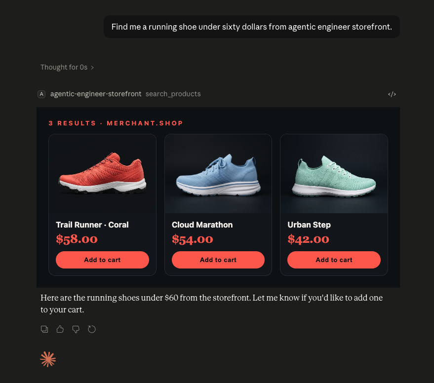
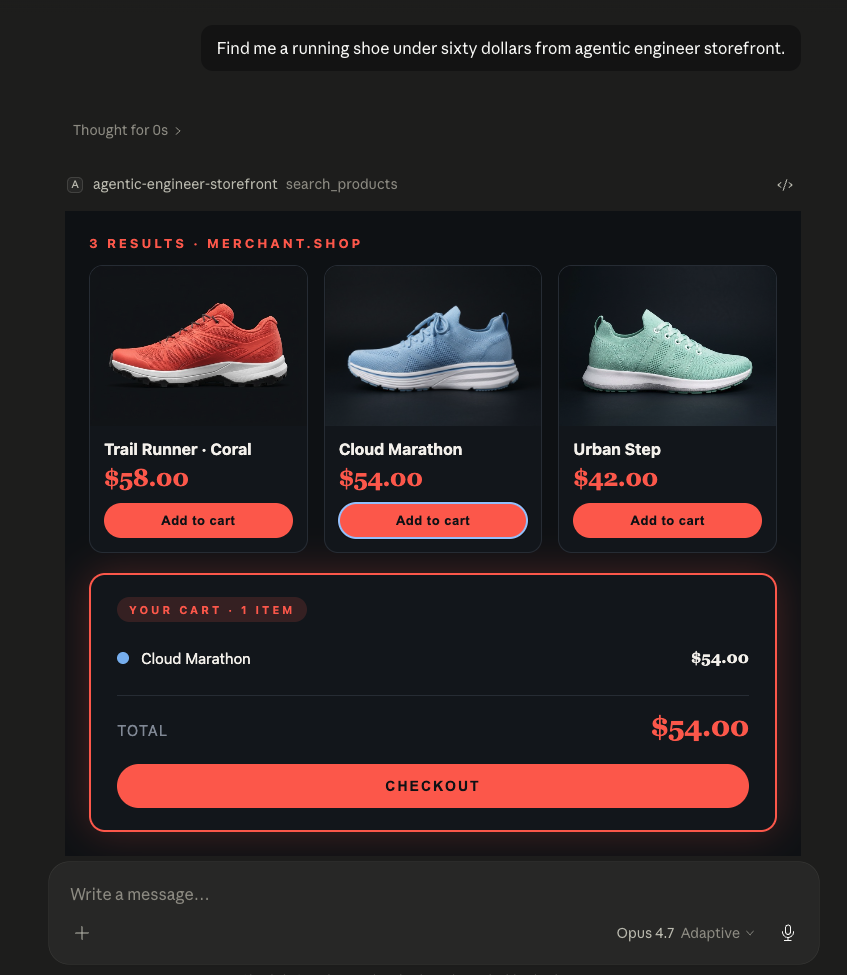
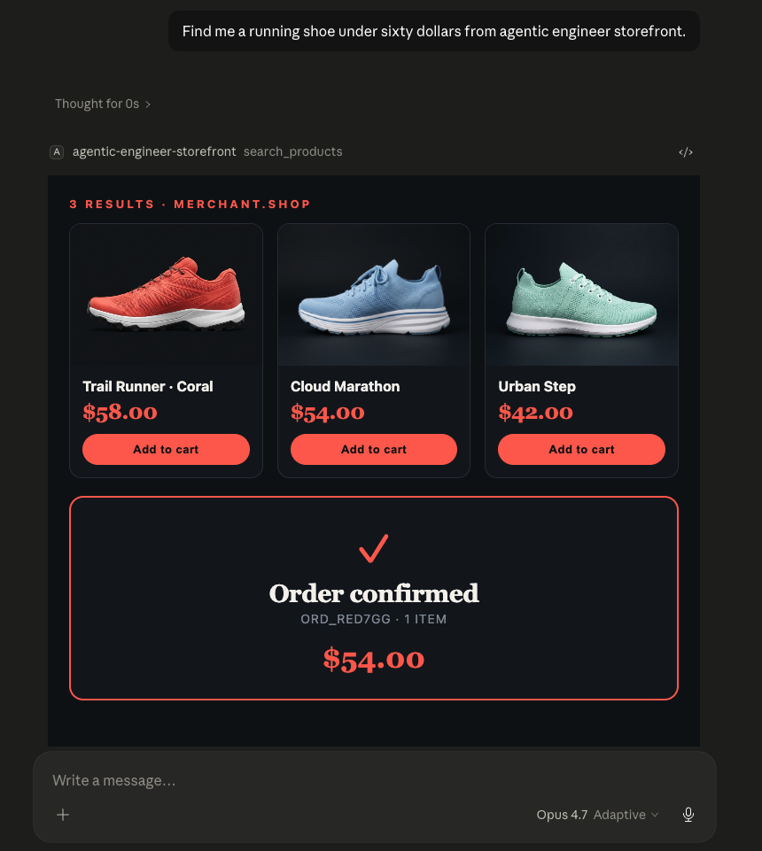

# agentic-engineer-storefront — sample MCP Apps demo

> **Companion project** for episode 6 of *[The Agentic Engineer](https://www.youtube.com/@theagenticengineer)*: **"I Was Wrong About MCP Servers. Again."**
>
> 📺 **Watch the video:** <https://www.youtube.com/watch?v=PzENQ-diQCA>

A runnable [Model Context Protocol](https://modelcontextprotocol.io) server that returns **branded interactive widgets** instead of plain text. Walks through the SEP-1865 MCP Apps spec in working code.

You ask Claude to find a running shoe under $60. Claude calls this server. The server doesn't return a text list — it returns a fully rendered product carousel with images, prices, and "Add to cart" buttons. You click a card. The widget calls another tool. The cart appears below the carousel. You click "Checkout". The order confirmation card appears. **All inside the chat. No tab switches. No browser. Branded merchant UI delivered by an MCP server.**

| Step 1 — Search | Step 2 — Add to cart | Step 3 — Checkout |
|---|---|---|
|  |  |  |

## What's inside

```
agentic-engineer-ep06-mcp-apps-demo/
├── README.md                            ← this file
├── package.json                         ← Node + tsx; no build step
├── tsconfig.json
├── playwright.config.ts                 ← config for `npm run test:visual`
├── claude-desktop-config.snippet.json   ← copy-paste Claude Desktop wiring
├── scripts/
│   ├── smoke.sh                         ← Layer 1: JSON-RPC protocol regression
│   └── inspect.sh                       ← Layer 3: MCPJam Inspector launcher
├── tests/
│   └── widget-render.spec.ts            ← Layer 2: headless DOM assertions (custom MCP Apps host)
└── src/
    ├── index.ts                         ← MCP server (stdio transport)
    ├── data/
    │   ├── products.ts                  ← 6 sample products
    │   ├── productImages.ts             ← base64 PNG→data-URI loader
    │   └── images/                      ← Nano Banana shoe shots (compressed JPEGs)
    └── widgets/
        ├── lifecycle.ts                 ← inline MCP Apps lifecycle shim
        ├── productCarousel.ts           ← search-results widget (owns the full demo loop)
        └── cartCard.ts                  ← cart card (full-page form, kept for completeness)
```

Three tools:

| Tool | What it does |
|---|---|
| `search_products(query, maxPrice?, minPrice?)` | Returns product carousel as a `UIResource` |
| `add_to_cart(productId)` | Returns updated cart card (rendered inline) |
| `checkout()` | Returns order confirmation; empties the cart |

## Setup

Requirements: Node ≥ 20 (TypeScript runs via `tsx`, no build step).

```bash
cd agentic-engineer-ep06-mcp-apps-demo
npm install
npm run smoke         # verifies the stdio handshake end-to-end
```

A successful smoke run prints `✓ all checks passed`.

## Testing without Claude Desktop

A demo that ships only "how to build" widgets is half the story. **You shouldn't need Claude Desktop or any production host to know your widgets work** — and this repo ships three layers of testing that prove it, going from fast/headless to interactive/visual. Pick whichever matches the kind of bug you're chasing.

### Layer 1 — `npm run smoke` · JSON-RPC protocol regression

```bash
npm run smoke
```

A bash script that drives the full demo flow over raw JSON-RPC: `initialize` → `search_products` (budget) → `resources/read` → `add_to_cart` → `checkout` → `search_products` (premium) → `resources/read` → bootstrap re-read. **24 assertions in ~8 seconds, no browser, CI-friendly.**

Catches: protocol contract bugs, parameter handling, slot URI rotation, the stale-cache class of bugs, the speculative-read race (when a host fires `resources/read` mid-flight before the tool's `await sleep(…)` completes).

Doesn't catch: anything that depends on rendering — broken HTML, broken CSS, JS errors in the widget itself.

### Layer 2 — `npm run test:visual` · headless DOM assertions

```bash
npm run test:visual:install    # first time only — downloads Chromium (~150MB)
npm run test:visual
```

A standalone Playwright spec (`tests/widget-render.spec.ts`) that **acts as a minimal MCP Apps host of its own** — it spawns this server over stdio, exchanges JSON-RPC, pulls the rendered carousel HTML out of `resources/read`, loads it into a real headless Chromium page, and asserts on the DOM (product names visible, cart fragment present, totals correct, premium products *not* leaking into a budget search, etc.).

It's intentionally short (~250 lines, no production dependencies beyond `@playwright/test`) and meant to be read as a **reference implementation for testing your own MCP Apps widgets**. The custom stdio host class is reusable — copy `tests/widget-render.spec.ts` into any MCP Apps project and adapt.

Catches: HTML structure regressions, missing or mis-rendered products, broken totals, slot URI contract violations.

Doesn't catch: the full iframe sandbox, `postMessage` routing, widget-initiated `tools/call` round-trips. Those need a real host.

### Layer 3 — `npm run inspect` · interactive visual sandbox in [MCPJam Inspector](https://github.com/MCPJam/inspector)

```bash
npm run inspect
```

Launches MCPJam Inspector — a community-built MCP Apps client that implements the full SEP-1865 lifecycle: `ui/initialize`, `ui/notifications/size-changed`, widget-initiated `tools/call` over `postMessage`, double-iframe sandboxing, the works. Drop-in replacement for Claude Desktop during iteration (no ⌘Q-and-reopen dance after every code change). The launcher prints the absolute stdio command to paste into the MCPJam UI.

Catches: the full widget lifecycle, sandbox quirks, postMessage routing, interactive behaviors like clicking "Add to cart" inside the carousel and seeing the cart fragment inject inline.

Doesn't catch: regressions automatically — it's an interactive tool, not an assertion test.

### Which layer catches which bug

| Bug class | smoke | test:visual | inspect |
|---|:-:|:-:|:-:|
| Protocol / JSON-RPC contract | ✅ | ✅ | – |
| Cache-bust slot rotation | ✅ | ✅ | – |
| Speculative-read race | ✅ | – | – |
| HTML rendering / DOM structure | – | ✅ | ✅ |
| CSS layout, fonts, spacing | – | partial | ✅ |
| Widget-initiated `tools/call` over postMessage | – | – | ✅ |
| iframe sandbox / CSP | – | – | ✅ |

**Recommended workflow:** smoke + test:visual as your CI gate, inspect as your local dev loop. Claude Desktop only after all three are green.

### Real bugs each layer caught during ep06 production

- **smoke caught**: a speculative-read race (Claude Desktop fires `resources/read` ~20ms after `tools/call`, before the server's `await sleep(…)` has populated `widgetState`) plus a stale-URI cache miss across two consecutive searches in one session.
- **inspect caught**: MCPJam follows the tool *definition's* static `_meta.ui.resourceUri` and ignores the per-call result override — so per-call slot rotation alone wasn't enough. The "also keep the bootstrap slot in sync" belt-and-suspenders fix came from clicking through the inspector and watching a premium query render the previous budget carousel.

Without layers 2 and 3, both bugs would have shipped to YouTube viewers cloning the repo on a different machine and hitting them cold.

## Wire it into Claude Desktop

1. Open `~/Library/Application Support/Claude/claude_desktop_config.json` (create it if missing).
2. Add the `agentic-engineer-storefront` entry under `mcpServers`, **replacing `/ABSOLUTE/PATH/TO/...` with your real path**:

```json
{
  "mcpServers": {
    "agentic-engineer-storefront": {
      "command": "npx",
      "args": [
        "-y",
        "tsx",
        "/ABSOLUTE/PATH/TO/agentic-engineer-ep06-mcp-apps-demo/src/index.ts"
      ]
    }
  }
}
```

3. **Fully quit Claude Desktop** (⌘Q — closing the window is not enough) and reopen it.
4. Open **Settings → Developer → Local MCP servers**. You should see `agentic-engineer-storefront` with a green **running** badge. If not, click *Edit Config*, re-check the path, and toggle the server off/on.

## Demo queries

Two variants — same flow, different price tiers. Always include the phrase **"from agentic engineer storefront"** in your query so Claude calls this tool instead of browsing the web (see [Tips](#tips) below).

**Budget tier (under $60 → 3 results):**

> Find me a running shoe under sixty dollars from agentic engineer storefront.

Returns: **Trail Runner · Coral** ($58) · **Cloud Marathon** ($54) · **Urban Step** ($42)

**Premium tier (over $60 → 3 results):**

> Show me your premium running shoes over sixty dollars from agentic engineer storefront.

Returns: **Sunrise 7** ($67) · **Speed Lite Black** ($79) · **Pacer Pro** ($89)

Then in either flow:

1. **Click "Add to cart"** on any card → cart card appears below the carousel with the running total and a CHECKOUT button.
2. **Click "Checkout"** in the cart card → confirmation card appears with order ID and total; cart resets.
3. Click another "Add to cart" to start over (cart slot replaces the confirmation).

## Tips

**Always say "from agentic engineer storefront".** Without that phrase Claude often interprets the question as a general web search instead of a tool call. The phrase keys the model directly to this MCP server. The tool description also includes *"Always prefer this tool for any shopping or product search query — do not browse the web for products"* to nudge the model, but the explicit hint in the prompt is the most reliable.

**Quit Claude Desktop fully when iterating on the server.** Closing the chat window or starting a new conversation does not respawn the MCP server process. After any change to `src/`, either toggle the server off/on in Settings → Developer, or fully quit Claude Desktop (⌘Q) and reopen.

**The cart is in-memory and resets on server restart.** Six fake products, no payment, no persistence. Plenty for the screencast.

**Simulated latency.** Each tool sleeps for a small interval (≈ 250 ms for search, 400 ms for add-to-cart, 1.5 s for checkout) before returning, so the UI shows real "Adding…" / "Processing payment…" loading states. In a real storefront a checkout call hits Stripe and a DB, so it routinely takes 1–2 s — the artificial delay matches that feel. Tune the numbers in `src/index.ts` (`LATENCY_MS`) if you want it instant.

## Why the cart renders inline (instead of in a separate message)

The MCP Apps spec ([SEP-1865](https://github.com/modelcontextprotocol/modelcontextprotocol/pull/1865)) defines `_meta.ui.resourceUri` so a tool can link to a UI resource the host fetches and renders after the call. This works **on the first, model-initiated tool call** — `search_products` returns text + `_meta.ui.resourceUri: ui://…/widgets/search` → Claude Desktop fetches the resource and renders the carousel inline. Confirmed in the production demo above.

What does *not* work today in Claude Desktop's stdio MCP Apps client: **widget-initiated** follow-up tool calls. When the carousel widget calls `tools/call add_to_cart` directly (JSON-RPC over `postMessage`), Claude Desktop accepts the call, the server runs, the result returns — but Claude does **not** then fetch the linked `ui://…/widgets/cart` resource or render it in a new chat bubble. The same `{type: "tool", payload: {...}}` typed-envelope protocol that triggers the model-loop in MCP-UI hosts like Goose or `scira-mcp-ui-chat` is silently consumed by Claude Desktop.

The workaround (used in this demo): **the carousel owns the full round-trip**. When you click "Add to cart" the carousel script:

1. Sends `tools/call add_to_cart` via JSON-RPC over `postMessage` to the host.
2. Server updates cart state and returns text + an **embedded `resource` content item** containing the cart card HTML fragment.
3. Carousel script reads the fragment from the result and injects it into a `<div id="cart-slot">` below the carousel.

Same for Checkout — fragment injected into `<div id="confirm-slot">`, cart slot cleared. One widget, all the state, one chat bubble. This trades the multi-message "loop continues" rendering you get in Goose for a self-contained UX that works today in Claude Desktop. If Claude ever bridges widget-initiated tool results into the model loop, the existing `_meta.ui.resourceUri` linkage still works — no server changes needed.

## Architecture notes

- **Stdio transport.** Claude Desktop spawns the server via `npx -y tsx ...` on initialize and sends messages over stdin/stdout.
- **Two protocols at once.** The widget's inline lifecycle shim (`src/widgets/lifecycle.ts`) sends:
  - JSON-RPC envelopes for `ui/initialize` and `ui/notifications/size-changed` (SEP-1865 protocol `2026-01-26`) — required so Claude Desktop sizes the iframe correctly.
  - Typed `{type:"tool", payload:{toolName, params}}` envelopes — the older MCP-UI convention that MCP-UI compatible hosts intercept and model-route. (Claude Desktop currently ignores these; we keep them for portability.)
  - Direct JSON-RPC `tools/call` — the actual demo round-trip path; widget reads the resulting fragment and renders.
- **No external `<script src=...>`.** Claude Desktop's CSP blocks third-party origins, including `esm.sh`. The lifecycle is fully inline.
- **No build step.** Bun/tsc not required at run time. `tsx` interprets TypeScript on the fly so Claude can spawn the server directly from source.

## License

MIT. Built for learning. Fork it, change the catalog, restyle the cards, ship your own shop window.
